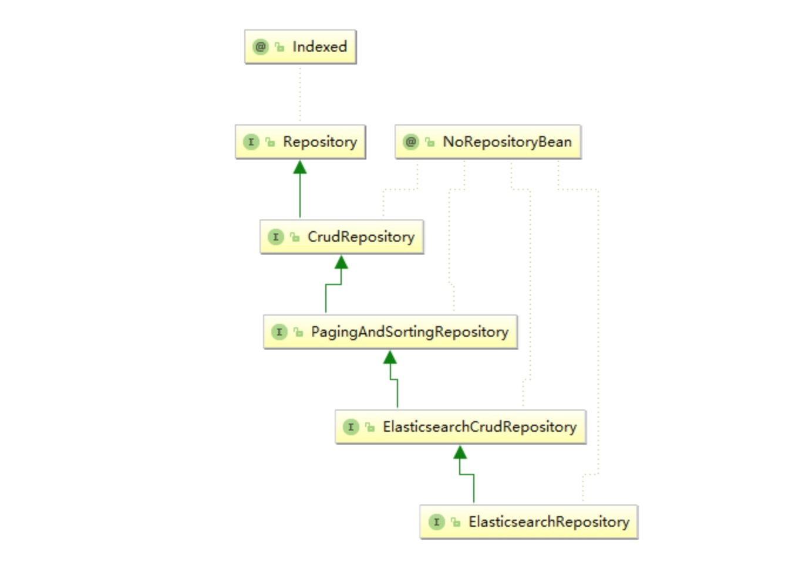

# Spring Boot 集成 ElasticSearch(全文搜索)

## 实践

在大规模搜索中使用 Spring Boot 操作 ElasticSearch 是一个最佳的选择

## 笔记

ElasticSearch 是一个开源的搜索引擎，建立在一个全文搜索引擎库 Apache Lucene™ 基础之上。 Lucene 可以说是当下最先进、高性能、全功能的搜索引擎库——无论是开源还是私有。

ElasticSearch 使用 Java 编写的，它的内部使用的是 Lucene 做索引与搜索，它的目的是使全文检索变得简单，通过隐藏 Lucene 的复杂性，取而代之提供了一套简单一致的 RESTful API。

然而，ElasticSearch 不仅仅是 Lucene，并且也不仅仅只是一个全文搜索引擎，它可以被下面这样准确地形容：

- 一个分布式的实时文档存储，每个字段可以被索引与搜索
- 一个分布式实时分析搜索引擎
- 能胜任上百个服务节点的扩展，并支持 PB 级别的结构化或者非结构化数据

***Spring Data ElasticSearch 和 ElasticSearch 是有对应关系的，不同的版本之间不兼容，Spring Boot 2.1 对应的是 Spring Data ElasticSearch 3.1.2 版本。***

Spring Data ElasticSearch	|ElasticSearch
---|---
3.1.x|	6.2.2
3.0.x	|5.5.0
2.1.x	|2.4.0
2.0.x	|2.2.0
1.3.x|1.5.2

## Spring Boot 集成 ElasticSearch

Spring Boot 在 spring-data-elasticsearch 的基础上进行了封装，让 Spring Boot 项目非常方便的去操作 ElasticSearch

```
<dependency>
    <groupId>org.springframework.boot</groupId>
    <artifactId>spring-boot-starter-data-elasticsearch</artifactId>
</dependency>
```

- 配置

```
# 集群名(默认值: elasticsearch，配置文件`cluster.name`: es-mongodb)
spring.data.elasticsearch.cluster-name=es-mongodb
# 集群节点地址列表，用逗号分隔
spring.data.elasticsearch.cluster-nodes=localhost:9300
```


- 配置

```
@Document(indexName = "customer", type = "customer", shards = 1, replicas = 0, refreshInterval = "-1")
public class Customer {
    @Id
    private String id;
    private String userName;
    private String address;
    private int age;
    //省略部分 getter/setter
}
```

- @Document 注解会对实体中的所有属性建立索引
- indexName = "customer" 表示创建一个名称为 "customer" 的索引
- type = "customer" 表示在索引中创建一个名为 "customer" 的 type
- shards = 1 表示只使用一个分片
- replicas = 0 表示不使用复制
- refreshInterval = "-1" 表示禁用索引刷新

- repository

```
public interface CustomerRepository extends ElasticsearchRepository<Customer, String> {
    public List<Customer> findByAddress(String address);
    public Customer findByUserName(String userName);
    public int  deleteByUserName(String userName);
}
```


### 基础操作


- 查询

```
@Test
public void fetchAllCustomers() {
    System.out.println("Customers found with findAll():");
    System.out.println("-------------------------------");
    for (Customer customer : repository.findAll()) {
        System.out.println(customer);
    }
}
```

```
输出：

Customers found with findAll():
-------------------------------
Customer{id='aBVS7WYB8U8_i9prF8qm', userName='Alice', address='北京', age=13}
Customer{id='aRVS7WYB8U8_i9prF8rw', userName='Bob', address='北京', age=23}
Customer{id='ahVS7WYB8U8_i9prGMot', userName='neo', address='西安', age=30}
Customer{id='axVS7WYB8U8_i9prGMp2', userName='summer', address='北京市海淀区西直门', age=22}
```

通过查询可以发现，***插入时自动生成了 ID 信息***。

- 删除

```
@Test
public void fetchAllCustomers() {
    @Test
    public void deleteCustomers() {
        repository.deleteAll();
        repository.deleteByUserName("neo");
    }
}
```

可以根据属性条件来删除，也可以全部删除。


- 修改

```
@Test
public void updateCustomers() {
    Customer customer= repository.findByUserName("summer");
    System.out.println(customer);
    customer.setAddress("北京市海淀区西直门");
    repository.save(customer);
    Customer xcustomer=repository.findByUserName("summer");
    System.out.println(xcustomer);
}
```
```
输出：

Customer[id=AWKVYFY4vPQX0UVGnJ7o, userName='summer', address='烟台']
Customer[id=AWKVYFY4vPQX0UVGnJ7o, userName='summer', address='北京市海淀区西直门']
```

### 以下是测试

- 根据地址信息来查询在北京的顾客信息:

```
@Test
public void fetchIndividualCustomers() {
    for (Customer customer : repository.findByAddress("北京")) {
        System.out.println(customer);
    }
}
```
```
输出：

Customer{id='aBVS7WYB8U8_i9prF8qm', userName='Alice', address='北京', age=13}
Customer{id='aRVS7WYB8U8_i9prF8rw', userName='Bob', address='北京', age=23}
Customer{id='axVS7WYB8U8_i9prGMp2', userName='summer', address='北京市海淀区西直门', age=22}
```
通过输出可以发现 ElasticSearch ***默认给我们进行的就是字段全文（模糊）查询***。

通过以上的示例发现使用 Spring Boot 操作 ElasticSearch 非常简单，通过少量代码即可实现我们日常大部分的业务需求。

### 高级使用

- 分页查询

分页查询有两种实现方式，第一种是使用 Spring Data 自带的分页方案，另一种是自行组织查询条件最后封装进行查询。我们先来看第一个方案：

```
@Test
public void fetchPageCustomers() {
    Sort sort = new Sort(Sort.Direction.DESC, "address.keyword");
    Pageable pageable = PageRequest.of(0, 10, sort);
    Page<Customer> customers=repository.findByAddress("北京", pageable);
    System.out.println("Page customers "+customers.getContent().toString());
}
```
这段代码的含义是，分页查询地址包含“北京”的客户信息，并且按照地址进行排序，每页显示 10 条。排序是使用的关键字是 address.keyword，而不是 address，属性后面带 ***.keyword 代表了精确匹配***。

- QueryBuilder


QueryBuilder 是一个功能强大的多条件查询构建工具，可以使用 QueryBuilder 构建出各种各样的查询条件。

```
@Test
public void fetchPage2Customers() {
QueryBuilder customerQuery = QueryBuilders.boolQuery()
            .must(QueryBuilders.matchQuery("address", "北京"));
    Page<Customer> page = repository.search(customerQuery, PageRequest.of(0, 10));
    System.out.println("Page customers "+page.getContent().toString());
}
```

使用 QueryBuilder 可以构建多条件查询，再结合 PageRequest 最后使用 search() 方法完成分页查询。

BoolQueryBuilder 有一些关键字和 AND、OR、NOT一一对应：

- must(QueryBuilders):AND
- mustNot(QueryBuilders):NOT
- should::OR
- QueryBuilder 是一个强大的多条件构建工具，有以下几种用法。

### 精确查询

- 单个匹配：

```
//不分词查询 参数1： 字段名，参数2：字段查询值，因为不分词，所以汉字只能查询一个字，英语是一个单词
QueryBuilder queryBuilder=QueryBuilders.termQuery("fieldName", "fieldlValue");
//分词查询，采用默认的分词器
QueryBuilder queryBuilder2 = QueryBuilders.matchQuery("fieldName", "fieldlValue");
```

- 多个匹配：

```
//不分词查询，参数1：字段名，参数2：多个字段查询值,因为不分词，因此汉字只能查询一个字，英语是一个单词
QueryBuilder queryBuilder=QueryBuilders.termsQuery("fieldName", "fieldlValue1","fieldlValue2...");
//分词查询，采用默认的分词器
QueryBuilder queryBuilder= QueryBuilders.multiMatchQuery("fieldlValue", "fieldName1", "fieldName2", "fieldName3");
//匹配所有文件，相当于就没有设置查询条件
QueryBuilder queryBuilder=QueryBuilders.matchAllQuery();
```

- 模糊查询

模糊查询常见的 5 个方法如下：

```
//1.常用的字符串查询
QueryBuilders.queryStringQuery("fieldValue").field("fieldName");//左右模糊
//2.常用的用于推荐相似内容的查询
QueryBuilders.moreLikeThisQuery(new String[] {"fieldName"}).addLikeText("pipeidhua");//如果不指定filedName，则默认全部，常用在相似内容的推荐上
//3.前缀查询，如果字段没分词，就匹配整个字段前缀
QueryBuilders.prefixQuery("fieldName","fieldValue");
//4.fuzzy query:分词模糊查询，通过增加 fuzziness 模糊属性来查询，如能够匹配 hotelName 为 tel 前或后加一个字母的文档，fuzziness 的含义是检索的 term 前后增加或减少 n 个单词的匹配查询
QueryBuilders.fuzzyQuery("hotelName", "tel").fuzziness(Fuzziness.ONE);
//5.wildcard query:通配符查询，支持* 任意字符串；？任意一个字符
QueryBuilders.wildcardQuery("fieldName","ctr*");//前面是fieldname，后面是带匹配字符的字符串
QueryBuilders.wildcardQuery("fieldName","c?r?");
```

- 范围查询

```
//闭区间查询
QueryBuilder queryBuilder0 = QueryBuilders.rangeQuery("fieldName").from("fieldValue1").to("fieldValue2");
//开区间查询
QueryBuilder queryBuilder1 = QueryBuilders.rangeQuery("fieldName").from("fieldValue1").to("fieldValue2").includeUpper(false).includeLower(false);//默认是 true，也就是包含
//大于
QueryBuilder queryBuilder2 = QueryBuilders.rangeQuery("fieldName").gt("fieldValue");
//大于等于
QueryBuilder queryBuilder3 = QueryBuilders.rangeQuery("fieldName").gte("fieldValue");
//小于
QueryBuilder queryBuilder4 = QueryBuilders.rangeQuery("fieldName").lt("fieldValue");
//小于等于
QueryBuilder queryBuilder5 = QueryBuilders.rangeQuery("fieldName").lte("fieldValue");
```

- 多条件查询

```
QueryBuilders.boolQuery()
QueryBuilders.boolQuery().must();//文档必须完全匹配条件，相当于 and
QueryBuilders.boolQuery().mustNot();//文档必须不匹配条件，相当于 not
```
- 聚合查询

聚合查询分为五步来实现，我们以统计客户总年龄为例进行演示。

````
第一步，使用 QueryBuilder 构建查询条件：

QueryBuilder customerQuery = QueryBuilders.boolQuery()
         .must(QueryBuilders.matchQuery("address", "北京"));
第二步，使用 SumAggregationBuilder 指明需要聚合的字段：

SumAggregationBuilder sumBuilder = AggregationBuilders.sum("sumAge").field("age");
第三步，以前两部分的内容为参数构建成 SearchQuery：

SearchQuery searchQuery = new NativeSearchQueryBuilder()
        .withQuery(customerQuery)
        .addAggregation(sumBuilder)
        .build();
第四步，使用 Aggregations 进行查询：

Aggregations aggregations = elasticsearchTemplate.query(searchQuery, new ResultsExtractor<Aggregations>() {
        @Override
        public Aggregations extract(SearchResponse response) {
            return response.getAggregations();
        }
    });
第五步，解析聚合查询结果：

//转换成 map 集合
Map<String, Aggregation> aggregationMap = aggregations.asMap();
//获得对应的聚合函数的聚合子类，该聚合子类也是个 map 集合，里面的 value 就是桶 Bucket，我们要获得 Bucket
InternalSum sumAge = (InternalSum) aggregationMap.get("sumAge");
System.out.println("sum age is "+sumAge.getValue());
```

