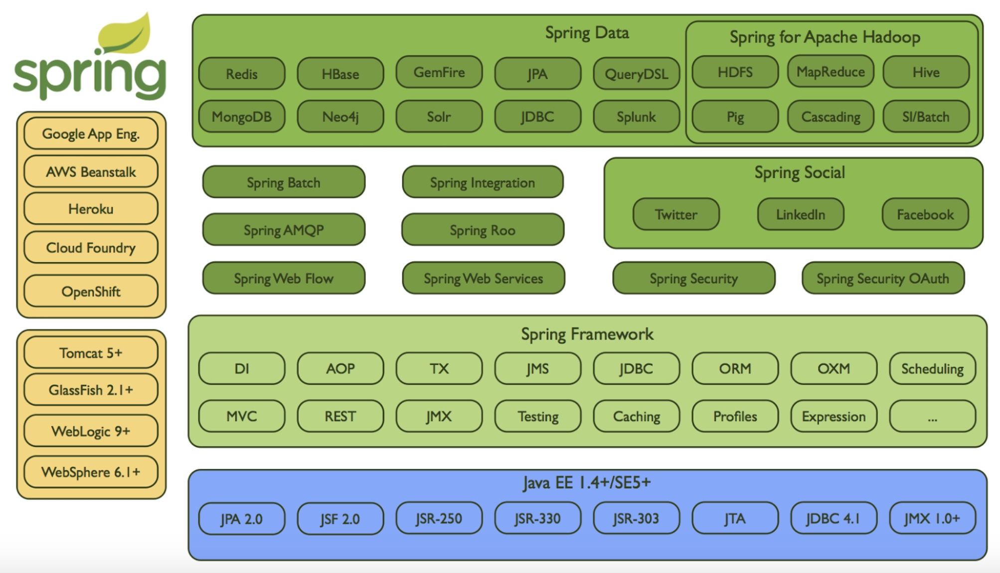

# 实践课程以及总结

## 实践课程关注点

1. 项目开发的的目录组织结构

2. 分布式Session管理

3. 数据库操作

4. Filter定义

## 学习总结

1. 从零开始认识 Spring Boot，主要介绍了什么是 Spring Boot、诞生的背景和设计理念，Spring Boot 2.X 主要更新了哪些内容

2. 主要介绍了项目中 Spring Boot Web 的相关技术，如今所有研发的项目中 Web 项目占据了 90 % 以上市场份额，Web 开发技术是我们最常使用的。因此这部分内容介绍了如何使用 Spring Boot 创建常见的 Web 应用，包括 Spring Boot 整合 JSP；模板引擎 Thymeleaf 的基础使用、高阶使用、页面布局；Web 开发过程中有一些常见的使用场景，如上传文件、构建 RESTful 服务、Swagger 2 的使用，以及如何使用 WebSocker 技术创建一个多人聊天室等。

3. Spring Boot 和数据库技术实践，数据是公司最重要的资产，在项目开发中数据库操作是永远无法绕过的一步，也是最高频最重要的功能操作。这部分内容介绍了数据库操作的三大 ORM 框架：JDBC、MyBatis、Spring Boot JPA，演示了如何在 Spring Boot 项目中集成操作、构建多数据源、集成 Druid 连接池等，最后使用 JPA 和 Thymeleaf 综合实践。

4. Spring Boot 集成 MQ、缓存、NoSQL 等中间件，中间件是互联网公司支撑高并发业务的必备组件，常用的组件有缓存、消息中间件、NoSQL 数据库、定时任务等。这部分内容介绍了项目中这些中间件的使用方式，以及如何使用 Spring Boot 设计一个邮件系统。

5. 综合实践，最后一部分主要关注的是 Spring Boot 项目的安全控制、应用监控、集群监控、测试部署、Docker 打包部署，最后用一个简单的用户管理系统回顾了课程中的相关技术点。

Spring Boot约定优于配置是一种设计思想

### Spring 技术栈所包含的技术框架图如下：

在课程的最后，推荐一些 Spring Boot 的学习资源：

- [Spring Boot 参考指南](https://docs.spring.io/spring-boot/docs/current/reference/htmlsingle/)，是 Spring 官方提供学习 Spring Boot 的文档，比较详细地讲述了 Spring Boot 的使用；

- [Spring Boot 中文索引](http://springboot.fun/)，这是一个专业收集 Spring Boot 学习资源的开源项目，全网有最全的 Spring Boot 开源项目和文章；

- [云收藏](https://github.com/cloudfavorites)，是一个使用 Spring Boot 2.0 相关技术栈构建的个人收藏类开源项目，使用了课程中的大部分技术，目前 GitHub 上面的 Star 数超过了 2600；

- [spring-boot-examples](https://github.com/ityouknow/spring-boot-examples)，GitHub 上关于 Spring Boot 使用的各种小案例，Star 数量超过了 7300，是 GitHub 上 Star 最多的个人 Spring Boot 开源项目之一；

- [公号“纯洁的微笑”](http://www.ityouknow.com/assets/images/keeppuresmile.jpg)，这个公号会定期发布业内优秀的 Spring Boot 使用案例；

- [博客](http://www.ityouknow.com/)，会持续跟踪 Spring Boot 技术的最新进展，欢迎大家关注。

